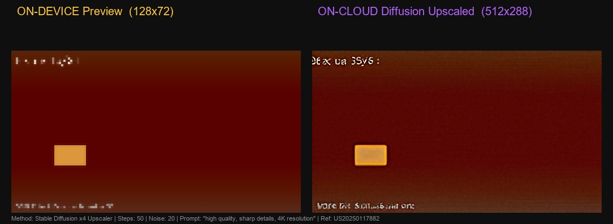

# Diffusion Video Upscaling Pipeline (US20250117882)

Hybrid AI Pipeline for Generative Video Super-Resolution
On-Device Preview → Cloud Diffusion Upscaling → High-Resolution Video

This repository demonstrates a **diffusion-based video upscaling architecture** inspired by the patent **US20250117882 — Generation of High-Resolution Images (2025)**.

Unlike traditional CNN or interpolation methods, this system uses a **latent diffusion model** to reconstruct high-resolution frames from low-resolution inputs.

The architecture simulates a **hybrid edge-cloud AI system** where:

* 📱 The device generates a preview and handles privacy-sensitive operations
* ☁️ The cloud performs GPU-intensive generative upscaling
* 📱 The device reconstructs the final video output

---

# Demo Pipeline



Left: On-device preview (128×72)
Right: Diffusion-generated high-resolution output (512×288)

---

# Key Idea

Traditional upscaling methods reconstruct detail using interpolation or CNN filters.

Diffusion models take a different approach:

1. Encode the low-resolution image into a **latent representation**
2. Add controlled **Gaussian noise**
3. Iteratively **denoise the latent representation**
4. Decode the result into a **high-resolution image**

This allows the model to **generate realistic high-frequency detail that was not present in the original image**.

---

# Architecture

```
[Device]

Step 1: Low-resolution preview generation (GIF)
      │
      ▼
User confirmation gate
      │
Step 2: Frame preparation + integrity tokens
      │
      ▼

[Cloud Processing]

Stable Diffusion x4 Upscaler
Latent diffusion denoising
Prompt-guided detail synthesis
Light sharpening
      │
      ▼

[Device]

Step 4: Frame verification
Step 5: Final video reconstruction
      │
      ▼

High-Resolution Video Output
```

---

# Processing Pipeline

| Step | Location | Description                         |
| ---- | -------- | ----------------------------------- |
| 0    | Input    | Load or generate source frames      |
| 1    | Device   | Generate low-resolution preview GIF |
| 2    | Device   | Prepare frames for cloud            |
| 3    | Cloud    | Latent diffusion upscaling          |
| 4    | Device   | Verify frame integrity              |
| 5    | Output   | Assemble final video                |

---

# Example Outputs

## Device Preview


## Final Output

`step4_final_video.mp4`

---

# Core Technologies

Python
PyTorch
Stable Diffusion Upscaler
HuggingFace Diffusers
OpenCV
Generative AI / Diffusion Models
Hybrid Edge-Cloud Architecture

---

# Model

Stable Diffusion x4 Upscaler
Model ID: `stabilityai/stable-diffusion-x4-upscaler`

Approximate size:

```
~3.4 GB
```

The model runs **latent diffusion denoising in compressed space**, enabling high-quality upscaling.

---

# Installation

### Step 1 — Install PyTorch with CUDA

```
pip install torch torchvision --index-url https://download.pytorch.org/whl/cu121
```

### Step 2 — Install required libraries

```
pip install diffusers transformers accelerate opencv-contrib-python pillow numpy requests
```

---

# Running the Demo

Run automatic demo

```
python diffusion_upscaling_demo.py --demo
```

Fast test

```
python diffusion_upscaling_demo.py --demo --frames 2 --steps 20
```

Use your own video

```
python diffusion_upscaling_demo.py --input video.mp4
```

Use a prompt to guide detail generation

```
python diffusion_upscaling_demo.py --demo --prompt "sharp cinematic 4K video"
```

---

# Output Files

| File                     | Description                |
| ------------------------ | -------------------------- |
| step1_lowres_preview.gif | Device preview             |
| step2_cloud_frames/      | Frames sent to cloud       |
| step3_upscaled_frames/   | Diffusion-upscaled frames  |
| step4_final_video.mp4    | Final reconstructed video  |
| pipeline_comparison.jpg  | Before vs after comparison |

---

# Performance

Typical runtime on **RTX 3060 6GB**

| Stage                   | Time           |
| ----------------------- | -------------- |
| Frame diffusion upscale | ~10–30 seconds |
| Demo (8 frames)         | ~2–4 minutes   |

Diffusion produces the **highest visual quality** but is slower than CNN-based methods.

---

# Research Motivation

This prototype explores **generative AI pipelines for video reconstruction**.

The architecture demonstrates how diffusion models can be integrated into **hybrid device-cloud systems** for:

* mobile video enhancement
* streaming upscaling
* AI video generation
* AR/VR rendering pipelines
* cloud-assisted media processing

---

# Repository Structure

```
US20250117882-diffusion
│
├── diffusion_upscaling_demo.py
├── Diffusion_Upscaling_Documentation.docx
│
├── pipeline_comparison.jpg
├── step1_lowres_preview.gif
├── step4_final_video.mp4
│
└── README.md
```

---

# Author

Iqbal Mauludi
AI Systems / Video Processing / Generative AI
